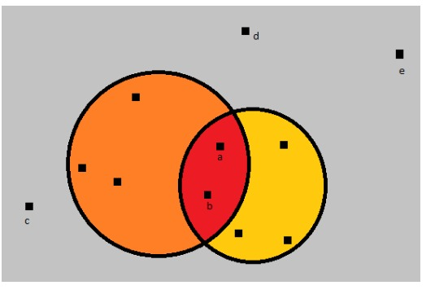

## WiFi Network

As we all know Shopee is one of the fastest-growing e-commerce in the world. Shopee has a large number of engineers to develop and maintain the platform. So it's expected it’s internal office network is very complex and only one master WiFi network hub has already failed to support the network stability and bandwidth. Now Shopee has decided to get master WiFi network hubs from two different companies namely GeoFi and AirFi. However now there is another big problem, these two networking device manufacturing companies have a long history of rivalry. They developed their network technology in such a way that these two networks cancel each other. Meaning, if an engineer is inside the network range of both GeoFi and AirFi network hubs, he/she will not get any signal from either of these two network hubs (see the picture).

As installing networking devices without very complex calculation can bring networking blackout at different locations on the office floor, shopee IT-center decided to install only one GeoFi network hub on the office floor. The same rule goes for the AirFi network hub. Each hub has a range R and they cover a circular area of radius R centering the position of the network hub. Shopee IT-center wishes every engineer should get the WiFi signal from one of the two new network hubs. Now Shopee IT-center wants your help to get the answer to the following question. Given the coordinates of each of the engineers, coordinates of the GeoFi network hub Cg and AirFi network hub Ca, the range of these network hubs Rg(GeoFi) and  Ra(AirFi) can you find the number of engineers that will not get any network services?

In the picture above the two points (a,b) in the intersected area do not get any WiFi signal. Also the three points(c,d,e) outside the area of the circles do not have any WiFi signal.

## Input

There will be only one test case. The test case begins with an integer N (1 ≤ N ≤ 10^5), the number of engineers in the office. 

Each of the next N lines will have two integers x, y (0 ≤ x,y ≤ 10^8) representing the coordinates of the engineers.

The next line contains four integers Xg, Yg representing Cg, and Xa, Ya representing Ca. 

The next line contains an integer number Q (1 ≤ Q ≤ 10^5), representing the number of queries. Each of the next Q lines will have two integers Rg, Ra (0 ≤ Rg, Ra ≤ 10^8).

## Output

For each query (given value of Rg, Ra), print the number of engineers that will not get any WiFi signal.

SAMPLE INPUT
11
2 3
3 6
5 5
6 10
9 7
8 5
9 4
11 3
12 6
11 12
14 10
6 7 10 5
5
4 3
3 3
9 3
8 3
3 2

SAMPLE OUTPUT
5
6
5
6
7